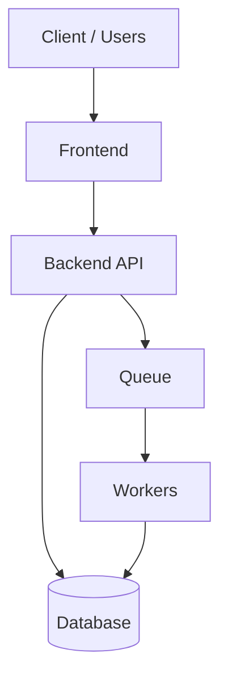

# {Project Name} — {Short Professional Tagline}

> {Public/Private}: {e.g., Public Project | 🔒 Private Enterprise Project}

One-sentence summary of the product and the outcome.

---

## Overview

**Problem**
- What real-world problem did this solve?

**Solution**
- What did you build and how does it work at a high level?

**Impact (if you can share)**
- Latency reduced by {x}% / manual work reduced / fewer incidents / adoption numbers.

---

## Features

- Feature 1
- Feature 2
- Feature 3
- Feature 4
- Feature 5

---

## Screenshots (use blurred/mock data if needed)

- Dashboard
- Charts
- Login
- Monitoring
- AI prediction result
- Architecture diagram

---

## Tech Stack

Put these as badges or a compact list:

- Language(s): {…}
- Framework(s): {…}
- DB: {…}
- Messaging: {…}
- Background jobs: {…}
- ML/AI: {…}
- Hosting/DevOps: {…}

---

## Architecture

### System diagram



### Key design points

- Why this architecture?
- How you handle scale / retries / failures
- How you handle data quality / validation

---

## Challenges & Solutions

### Challenge 1
**Problem**: …

**Solution**: …

### Challenge 2
**Problem**: …

**Solution**: …

---

## Your Contribution

Be specific and show scope:

- Owned {module/service/feature} end-to-end
- Implemented {API / pipeline / model integration}
- Improved {performance/reliability}
- Collaborated with {teams} and shipped to {environment}

---

## Documentation PDF

Link your PDF here:

```md
[Documentation PDF](/docs/{project}-case-study.pdf)
```

---

## Confidentiality Notice (if needed)

🔒 Source code is not publicly available due to organizational confidentiality.

This case study shares architecture, technology choices, and engineering contributions only.
